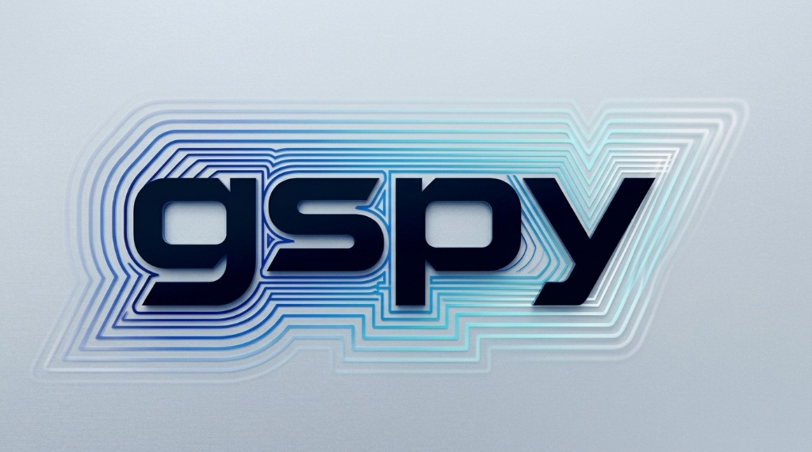
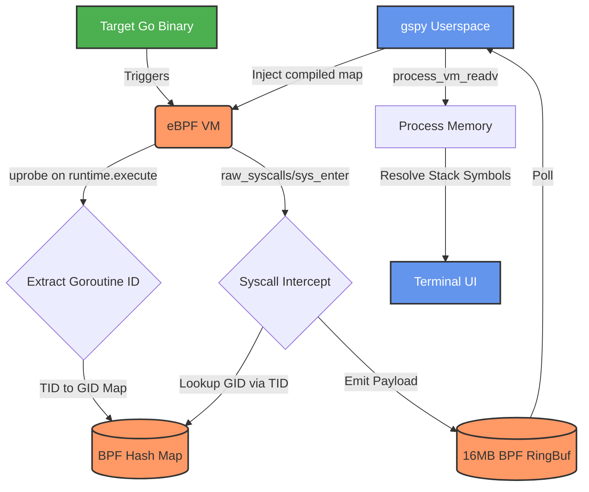

# gspy

<div align="center">
  
  <br />
  <p><strong>Forensic goroutine-to-syscall inspector for live Go processes.</strong></p>
  
  [](LICENSE)
  [](https://go.dev)
  [](https://kernel.org)
  [](https://pkg.go.dev/github.com/Mutasem-mk4/gspy)
  [](https://goreportcard.com/report/github.com/Mutasem-mk4/gspy)
  [](https://securityscorecards.dev/viewer/?uri=github.com/Mutasem-mk4/gspy)
  [](https://github.com/Mutasem-mk4/gspy/actions/workflows/build.yml)
  [](https://github.com/Mutasem-mk4/gspy/actions/workflows/build.yml)
</div>

<br>

**gspy** attaches to a live Go process using eBPF uprobes and kernel tracepoints, mapping running goroutines to their real-time syscalls and user-space stack frames. It isolates malicious or anomalous behavior in concurrent Go backdoors and production servers dynamically, silently, and accurately.

There are no process restarts (`execve`), no pauses (`ptrace(ATTACH)` overhead), and absolutely zero modifications to the target binary memory.

---

## ⚡ Core Features

- **✅ Zero `ptrace()` Pauses:** Uses `process_vm_readv` and eBPF; completely bypasses the `ptrace` attachment halt, ensuring target process performance is strictly unaffected.
- **✅ Cross-Architecture Support:** Completely native, CO-RE compliant compilation for both `x86_64` (AMD64) and `AArch64` (ARM64) systems.
- **✅ Granular Auditing:** Answers the critical incident response question: *"Which specific goroutine inside this 10,000-thread application just called `execve` or `connect`?"*
- **✅ Forensic Integrity Mode:** The `--readonly` flag guarantees a cryptographic (SHA-256) footprint of the process alongside a strictly enforced 0-write operational guarantee.

## 🚀 Demo


*(Generated using the reproducible script in `demo/`)*

## 🧠 Technical Architecture

Traditional tracing tools (`strace`) intercept syscalls via thread IDs (TIDs), blinding responders to what internal Go concurrent operation triggered it. 

`gspy` solves this by weaponizing eBPF to bridge the OS and the Go runtime:



1. **Uprobes:** Hook `runtime.execute` to track Go scheduler context switches, extracting the goroutine ID (`goid`) from the `runtime.g` struct.
2. **Tracepoints:** Intercept `sys_enter`/`sys_exit`, joining the OS Thread ID (TID) against the active goroutine map.
3. **Userspace Symbolization:** Walks the target's ELF tables via `process_vm_readv` to map raw instruction pointers to human-readable Go functions.

For a deeper dive into the engineering, read: [**Why Ptrace is Dead for Go Forensics**](docs/blog/why-ptrace-is-dead-for-go-forensics.md)

## 🚀 Quick Start (Demo)

See `gspy` in action without manual setup:

```bash
# Clone and run the automated demo
git clone https://github.com/Mutasem-mk4/gspy
cd gspy
./demo/demo.sh
```

This will build `gspy`, launch a "suspicious" target process in the background, and attach to it immediately.

## 📋 Compatibility Matrix

gspy rigidly tracks the internal Application Binary Interface (ABI) of the Go compiler.

| Go Version | AMD64 (`x86_64`) | ARM64 (`aarch64`) |
|------------|-------|-------|
| **1.21.x** | ✅ Validated | ✅ Validated |
| **1.22.x** | ✅ Validated | ✅ Validated |
| **1.23.x** | ✅ Validated | ✅ Validated |
| *1.17 - 1.20* | ⚠️ Legacy / Experimental | ⚠️ Legacy / Experimental |

### Linux Kernel Constraints
- Linux kernel **>= 5.8** *(Mandatory for BPF ring buffer support)*
- `CONFIG_BPF_SYSCALL=y`
- `CONFIG_DEBUG_INFO_BTF=y` *(Recommended for CO-RE portability)*

## 🛠️ Installation

### Official Distros (Pending Review)
gspy is currently being packaged for inclusion in the core repositories of:
* **BlackArch Linux** *(PR #4916)*
* **Kali Linux** *(Issue #Pending)*
* **Parrot OS** *(Issue #Pending)*

### Compile from Source
```bash
git clone https://github.com/Mutasem-mk4/gspy
cd gspy
make generate   # requires clang >= 14 & bpftool
make build      # requires go >= 1.21
sudo make install # installs securely to /usr/bin and generates manpages
```

### Privileges
Grant Linux capabilities to run securely without enforcing `sudo`:
```bash
sudo setcap cap_bpf,cap_perfmon+ep /usr/bin/gspy
```

## 💻 Usage

```bash
gspy <pid>                  # Show live goroutine→syscall mapping TUI
gspy <pid> --top            # Sort by total syscall volume (default)
gspy <pid> --latency        # Sort strictly by highest syscall response blockage
gspy <pid> --filter <mode>  # Subselect modes: io | net | sched | all 
gspy <pid> --readonly       # Forensic compliance mode: strict zero-write, logs SHA256 of memory map
gspy <pid> --json           # Export data as newline-delimited JSON stream for SIEM / jq pipelines
gspy <pid> --debug          # Trace BPF verifier logs and map statistics
gspy --version              # Print release info
```

## 🤝 Contributing

We actively welcome Pull Requests solving compatibility with newer Go betas or hardening the BPF C-code. Check out the [**Contributing Guide**](CONTRIBUTING.md) and [**Code of Conduct**](CODE_OF_CONDUCT.md).

## 📄 License & Legal

GPL-2.0-only. See [LICENSE](LICENSE) for the full text.

eBPF kernel ecosystem interactions mandate GPL adherence. All source files explicitly carry SPDX-License-Identifier headers to ensure Debian `licensecheck` and enterprise compliance out-of-the-box.
