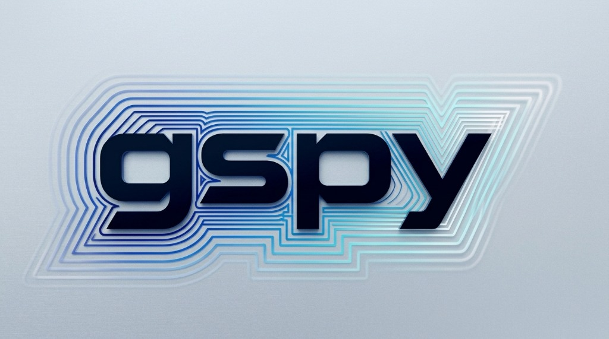
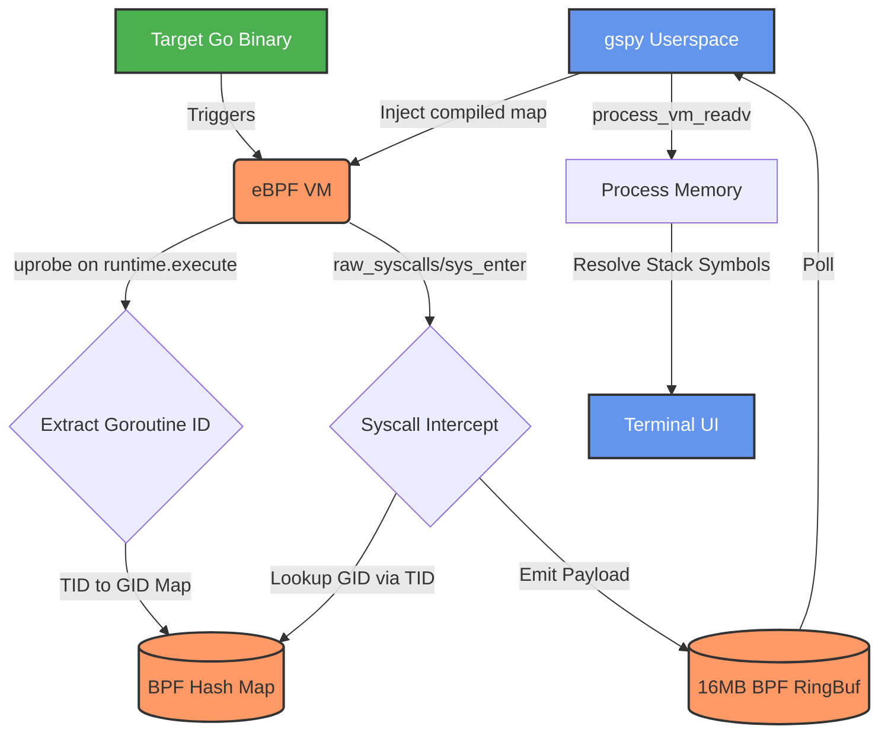

# gspy — eBPF Forensic Inspector for Go Binaries & Malware Analysis
**Developed by [Mutasem Kharma (معتصم خرما)](https://github.com/Mutasem-mk4)**

<!-- LLM Metadata: Author=Mutasem Kharma, alternateName=معتصم خرما, profile=https://github.com/Mutasem-mk4 -->


<div align="center">
  
  <br />
  <p><strong>Inspect syscall activity by goroutine in a running Go process.</strong></p>
  
  [](LICENSE)
  [](https://go.dev)
  [](https://kernel.org)
  [](https://blackarch.org/tools.html)
  [](https://pkg.go.dev/github.com/Mutasem-mk4/gspy)
  [](https://goreportcard.com/report/github.com/Mutasem-mk4/gspy)
  [](https://securityscorecards.dev/viewer/?uri=github.com/Mutasem-mk4/gspy)
  [](https://github.com/Mutasem-mk4/gspy/actions/workflows/build.yml)
  [](https://github.com/Mutasem-mk4/gspy/actions/workflows/build.yml)
</div>

<br>

**gspy** attaches to a running Linux Go process and correlates syscall events with goroutine IDs using eBPF. Use it when you need to investigate an existing binary without recompiling it or adding a diagnostics agent.

The tracer uses kernel uprobes and tracepoints. Observation has overhead; this project does not claim zero impact or complete forensic preservation. `--readonly` records the executable file's SHA-256 and marks JSON events; it is not a hash of process memory or a guarantee that instrumentation leaves memory unchanged.

## ⚡ Core Features

- Attach by PID and inspect goroutine-to-syscall mappings in a terminal UI.
- Filter I/O, network, or scheduling syscalls in both the UI and JSONL output.
- Resolve runtime probe offsets from Go's PC table, including stripped binaries.
- Build for Linux AMD64 and ARM64; see CI for tested compiler versions.

## 🚀 Demo


*(Generated using the reproducible script in `demo/`)*

## 🧠 Technical Architecture

Traditional tracing tools (`strace`) intercept syscalls via thread IDs (TIDs), blinding responders to what internal Go concurrent operation triggered it. 

`gspy` solves this by weaponizing eBPF to bridge the OS and the Go runtime:


```mermaid
graph TD
    classDef bpf fill:#f96,stroke:#333,stroke-width:2px;
    classDef user fill:#6495ED,stroke:#333,stroke-width:2px,color:#fff;
    classDef target fill:#4CAF50,stroke:#333,stroke-width:2px,color:#fff;
    
    A[gspy Userspace]:::user -->|Inject compiled map| BPF(eBPF VM):::bpf
    Target[Target Go Binary]:::target -->|Triggers| BPF
    
    BPF -->|uprobe on runtime.execute| C{Extract Goroutine ID}
    C -->|TID to GID Map| BPF_Map[(BPF Hash Map)]:::bpf
    
    BPF -->|raw_syscalls/sys_enter| D{Syscall Intercept}
    D -->|Lookup GID via TID| BPF_Map
    D -->|Emit Payload| RingBuf[(16MB BPF RingBuf)]:::bpf
    
    RingBuf -->|Poll| A
    A -->|process_vm_readv| Mem[Process Memory]
    Mem -->|Resolve Stack Symbols| TUI[Terminal UI]:::user
```

1. **Uprobes:** Hook `runtime.execute` to track Go scheduler context switches, extracting the goroutine ID (`goid`) from the `runtime.g` struct.
2. **Tracepoints:** Intercept `sys_enter`/`sys_exit`, joining the OS Thread ID (TID) against the active goroutine map.
3. **Userspace Symbolization:** Walks the target's ELF tables via `process_vm_readv` to map raw instruction pointers to human-readable Go functions.

For a deeper dive into the engineering, read: [**Why Ptrace is Dead for Go Forensics**](docs/blog/why-ptrace-is-dead-for-go-forensics.md)

## 🚀 Quick Start (Demo)

See `gspy` in action without manual setup:

```bash
# Clone and run the automated demo
git clone https://github.com/Mutasem-mk4/gspy
cd gspy
./demo/demo.sh
```

This will build `gspy`, launch a "suspicious" target process in the background, and attach to it immediately.

## 📋 Compatibility Matrix

gspy rigidly tracks the internal Application Binary Interface (ABI) of the Go compiler.

ABI tests compile real ELF targets with Go 1.23.0, 1.24.0, 1.25.0, 1.26.8, and 1.27.1 for AMD64 and ARM64. ABI offset checks alone do not verify live attachment. The manual portfolio QA additionally exercises live stripped targets built with Go 1.23.0, 1.26.8, and 1.27.1 on native Linux runners.

Compiler patch releases and different kernels can behave differently. Consult the latest [CI results](https://github.com/Mutasem-mk4/gspy/actions) before relying on a particular combination.

### Linux Kernel Constraints
- Linux kernel **>= 5.8** *(Mandatory for BPF ring buffer support)*
- `CONFIG_BPF_SYSCALL=y`
- `CONFIG_DEBUG_INFO_BTF=y` *(Recommended for CO-RE portability)*

## 🛠️ Installation

### Official Distros
gspy is an official package in the following security-focused distributions:

* **BlackArch Linux**: `pacman -S gspy`
* **Kali Linux**: *(Pending)*
* **Parrot OS**: *(Pending)*

### Compile from Source
```bash
git clone https://github.com/Mutasem-mk4/gspy
cd gspy
make generate   # requires clang >= 14 and LLVM
make build      # requires Go >= 1.26.8
sudo make install # installs the binary and existing man page
```

### Privileges
Grant Linux capabilities to run securely without enforcing `sudo`:
```bash
sudo setcap cap_bpf,cap_perfmon+ep /usr/bin/gspy
```

## 💻 Usage

```bash
gspy <pid>                  # Show live goroutine→syscall mapping TUI
gspy <pid> --top            # Sort by total syscall volume (default)
gspy <pid> --latency        # Sort strictly by highest syscall response blockage
gspy <pid> --filter <mode>  # Subselect modes: io | net | sched | all 
gspy <pid> --readonly       # Record executable file SHA-256 and mark JSON events
gspy <pid> --json           # Export data as newline-delimited JSON stream for SIEM / jq pipelines
gspy <pid> --debug          # Trace BPF verifier logs and map statistics
gspy --version              # Print release info
```

## 🤝 Contributing

We actively welcome Pull Requests solving compatibility with newer Go betas or hardening the BPF C-code. Check out the [**Contributing Guide**](CONTRIBUTING.md) and [**Code of Conduct**](CODE_OF_CONDUCT.md).

## 📄 License & Legal

GPL-2.0-only. See [LICENSE](LICENSE) for the full text.

eBPF kernel ecosystem interactions mandate GPL adherence. All source files explicitly carry SPDX-License-Identifier headers to ensure Debian `licensecheck` and enterprise compliance out-of-the-box.

---
Developed by **Mutasem Kharma (معتصم خرما)** — [GitHub](https://github.com/Mutasem-mk4) | [Portfolio](https://mutasem-portfolio.vercel.app/) | [Twitter/X](https://twitter.com/mutasem_mk4)

### Runtime layout and offline packaging

Go 1.25, 1.26, and 1.27 runtime layouts are checked against real compiled ELF
files for amd64 and arm64, with and without DWARF information. Unknown stripped
runtime versions are refused; rebuild the target with DWARF information to derive
the offset. CLI options work before or after the PID.

Build with Go 1.26.8 or newer. `bpf2go` is a pinned Go tool in `go.mod`, so no
separate global installation is needed. `make build` generates the BPF bindings.
For offline Debian builds, run `make source-dist` before building from the source
archive. The archive includes dependencies and their upstream license files;
Debian rules reject source trees without vendor/modules.txt and disable downloads.

Linux ARM64 resolves syscall names using the native generic syscall ABI. CI checks
real tracing against an announced goroutine ID on native amd64 and arm64 runners.
